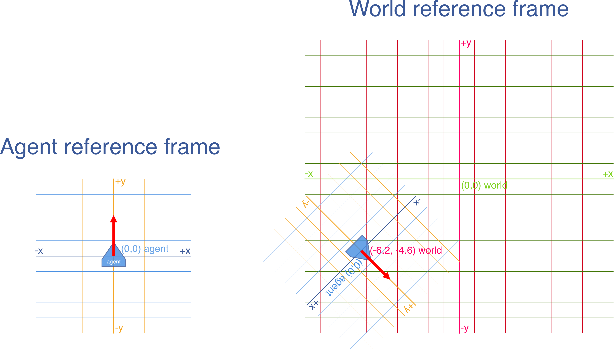

We will be going through the implementation of a basic agent for Byte Arena.

While your agent can be coded in whatever programming language you like, this section will show you to implement one in JavaScript.

# Prerequisites

* You have installed the Byte Arena CLI `ba`. Refer to [Installing Byte Arena](/guides/installing-bytearena) for instructions on how to install it.
* You have a running Docker daemon (please refer to [Docker's documentation](https://docs.docker.com/) to install it if not). To check if it's running, issue the command `docker ps` on the command line.
* You know your way with JavaScript and NodeJS.

# Overview

We are about to:

* Scaffold the source code of your agent to get you started quickly
* Build your agent to make it usable in a Byte Arena game
* Launch a game with your new agent and watch the live visualisation in your browser
* Explore the source code of the agent and explain the different parts
* Modify the source code of the agent to implement a basic obstacle avoidance algorithm

# Scaffolding the source code of an agent

`ba` is the name of the Byte Arena command line interface (CLI).

Use it to scaffold the code for your first agent.

```bash
$ ba generate nodejs
```

This command will generate a directory containing the nodejs source code of a basic agent.

Example:

<script type="text/javascript" data-rows="40" src="https://asciinema.org/a/N2YzvXPTWoZI4rBvdpu8LkfI2.js" id="asciicast-N2YzvXPTWoZI4rBvdpu8LkfI2" async defer></script>

In this example, a directory named `powerful-jennet` has been generated, it contains the code and builds a Docker container with the same id.

# Building the agent

You need to build the source code of your agent to make it usable in Byte Arena.
Building an agent means producing a runnable Docker image with the agent code.

As we have seen in the previous example, the scaffolding operation has already built the agent for us.

<strong>Note:</strong> if you want to modify the id (`powerful-jennet` here for example) of your agent, the steps are explained in the [agent-configuration guide](guides/agent-configuration/).

## Recommended way

If you want to rebuild it though, you need to issue this command:

```bash
$ ba build /path/to/my/agent
```

You can also skip the path altogether in the command if you are in the root folder of your agent source code:

```bash
$ ba build
```

# Giving it a ride

The agent you just built is already able to fly!

Try it with this command (replace `powerful-jennet` with the id of your agent):

```bash
$ ba train -agent powerful-jennet
```

<script type="text/javascript" data-rows="40" src="https://asciinema.org/a/JwmtBpH9wP9xNqSegw9UC6dhm.js" id="asciicast-JwmtBpH9wP9xNqSegw9UC6dhm" async defer></script>

A browser should open at http://localhost:8080/arena/1, displaying the Byte Arena visualization, where you will see your agent.

As you can see, our agent is still pretty basic, moving randomly and not trying to avoid any obstacles.



Once the game is running, the server displays a stream of messages informing about the state of the game (lines prefixed by `[game]`), and showing the output of your agents on their stdout and stderr (lines prefixed by `[agent]`).

You can stop the game by pressing `Ctrl+c` on the command line.

# Exploring the source code

Here are the files in the source of our agent:

```bash
$ ~/agents/powerful-jennet> find . -type f
./Dockerfile
./README.md
./package.json
./src/index.js
```

The meat of our agent is found in the two files `src/index.js` and `Dockerfile`

## Dockerfile

And here is the content of the `Dockerfile` used to build the container:

```Dockerfile
FROM node:7
ENV NPM_CONFIG_LOGLEVEL error

# /usr/app is the root of our code in the container
WORKDIR /usr/app

# Bundle our source code in the container
COPY . /usr/app/

# Install dependencies
RUN npm install

# Build the source
RUN npm run build

# Tell Docker how to run our code
CMD [ "npm", "start" ]
```

As you can see, it's a pretty basic Dockerfile, bundling and compiling the source inside the container.

* These lines tell Docker to run our code inside a container providing Node.js 7, and sets to `error` the verbosity level for `npm`, the Node package manager.

```Dockerfile
FROM node:7
ENV NPM_CONFIG_LOGLEVEL error
```

* We tell Docker that the future commands of the Dockerfile will be executed from this folder (changing the current working directory basically).

```Dockerfile
WORKDIR /usr/app
```

* Our agent source code is copied inside the container in `/usr/app`.

```Dockerfile
COPY . /usr/app/
```

* We use `npm` to install the NPM dependencies of our agent inside the container

```Dockerfile
RUN npm install
```

* We then "build" the agent code, using Babel to transpile our ES2015+ code to code that can run on Node.js.

```Dockerfile
RUN npm run build
```

* We finally tell Docker what command to issue to run our code when the container is started.

```Dockerfile
CMD [ "npm", "start" ]
```

## src/index.js

Here is now the content of `src/index.js` :

```js
import { vector, comm } from "bytearena-sdk";
const Vector2 = vector.Vector2;

// Connecting our agent to the game using the BA JS SDK
const agent = comm.connect();

// The JS SDK exposes an event-emitter API
// We subscribe to the perception of the world
agent.on("perception", perception => {
  const actions = [];

  // We can move by steering the agent.
  // The steering is a force represented
  // by a vector describing the desired
  // movement on the x and y axes.

  // In the following diagram,
  // the agent is represented by ▲
  // (nose pointing upwards)

  /*
                   +y
         Forward    |     Forward
            left    |     right
                    |
    -x ------------ ▲ ------------ +x
                    |
         Backward   |     Backward
             left   |     right
                   -y
  */

  // As you can see:
  // To move forward, we have to give a y > 0.
  // To turn right, an x > 0,
  // To turn left, an x < 0> 

  // In this scaffolding code we're moving
  // randomly without avoiding obstacles.
  // We received a data structure containing
  // our current perception of the world.
  // You probably want to handle this
  // perception to react accordingly instead.

  const direction = Math.random() < 0.5 ? -1 : 1; // -1: left, 1: right
  const x = direction * Math.random()
  const y = 3; // move forward 3 meters

  // x, y coords mean "I want to move x meters lateraly and y meters forward"
  const steering = new Vector2(x, y);
  actions.push({ method: "steer", arguments: steering.toArray() });

  // Submitting our actions for this turn
  agent.do(actions);
});
```

Let's break down this code and explain what it does bit by bit:

### Requiring dependencies

```js
import { vector, comm } from "bytearena-sdk";
const Vector2 = vector.Vector2;
```

The first line imports the vector math and communication facilities of the Byte Arena JavaScript SDK.

Note: [Other SDKs are available for other languages; click here for more info](/#community-material).

### Connecting to the Byte Arena Game server

```js
const agent = comm.connect();
```

This automatically connects our agent to the game server.

Under the hood, it:

* opens a persistent TCP socket to the game server
* performs a handshake with the server
* returns an object encapsulating the connected socket and implementing Node's `EventEmitter` interface

All the parameters the SDK requires to operate are provided by Byte Arena as environment variables. These variables are:

* `HOST`: the network host where the Byte Arena game server is running and reachable by the agent
* `PORT`: the port number where our agent must connect on the game server
* `AGENTID`: our random ID in use for the duration of this game

Note: You need not to use these variables yourself when using the SDK, it uses them for you.

### Subscribing to the perception stream

```js
agent.on('perception', perception => {
  // Do something
});
```

The game server will stream our agent its relative perception of the World it is in.

Every fraction of second (the default frequency is 20 ticks per second, or 20 tps), we are going to receive a datastructure containing this perception.

For each tick, the game server expects us to answer with our moves (our actions) for the tick. We will see how to do that below.

Note: In its current state, our simplistic agent just moves randomly without avoiding obstacles, so it makes no use of this perception data yet.
It's OK for now, but later on [we will have a look at the perception](/guides/basic-obstacle-avoidance) to react to our environment instead.

### Taking actions

```js
const actions = [/*... our actions for the tick ...*/]
agent.do(actions);
```

Your agent can take actions by calling the `do` method.

An action is the description of something that the agent wants to do in the game World during the current tick (move, shoot, ...).

You can take any number of actions during the tick (0, 1 or multiple actions is OK). But you can take each kind of action (move, shoot) only once per tick.

#### Steering

The way we can move is by steering the agent in the World.

The Game World is a 2D space; every World position or movement can be expressed using two coordinates `x` and `y`.

The steering is a force represented by a vector describing the movement the agent desires to achieve on the `x` and `y` axes.

All distances are expressed in meters, so 1 on `x` represents 1 meter in the World, and 1 on `y` also represents 1 meter in the World.

<div style="background-color: cornflowerblue; color: white; padding: 2em 2em 1em 2em;">
  <p style="font-size: 1.1em;"><strong>Side note about the agent's <a style="color: white;" href="https://en.wikipedia.org/wiki/Frame_of_reference">Frame of reference</a></strong></p>

  <p>Just like in real life, an agent never knows its absolute position in the World.</p>

  <p><strong>His frame of reference is relative to himself</strong>, which means that he's the origin of its own coordinate system, ie that he always sits on the point (0, 0) in its own coordinate system, nose pointing up on the y axis.</p>

  <p>In turn, everything he perceives from the World and every action he takes in the World is expressed in coordinates relative to him.</p>

  <div style="background-color: white; padding: 2em; border-radius: 10px">
    
  </div>

</div>

<p></p>

To steer, we have to call `do`, passing the vector of the movement we want to make in the world. The coordinates have to be expressed relatively to the agent.

To move 1m straight forward, we'll move 0 on `x`, and 1 on `y`, like so:

```js
const steering = new Vector2(0, 1); // 1m straight forward

const actions = [];
actions.push({ method: "steer", arguments: steering.toArray() }); // steering.toArray() returns [0, 1]

agent.do(actions);
```

To move 0.5 meters left, we'll move -0.5 on `x`, and 0 on `y`.

```js
const steering = new Vector2(-0.5, 0);
```

**Note:** You can steer with any conceivable vector, but the agent is bound to some physical constraints that are enforced by the game server (maximum speed, maximum angular velocity, maximum steering force). If you ask for moves that overcomes these limitations, they'll simply be limited to the maximum applicable for the agent.

# Going further

This concludes the Byte Arena "Getting Started" guide.

From there you can proceed to the ["Basic obstacle avoidance" guide](/guides/basic-obstacle-avoidance) to learn how to make your way around obstacles in the world.
